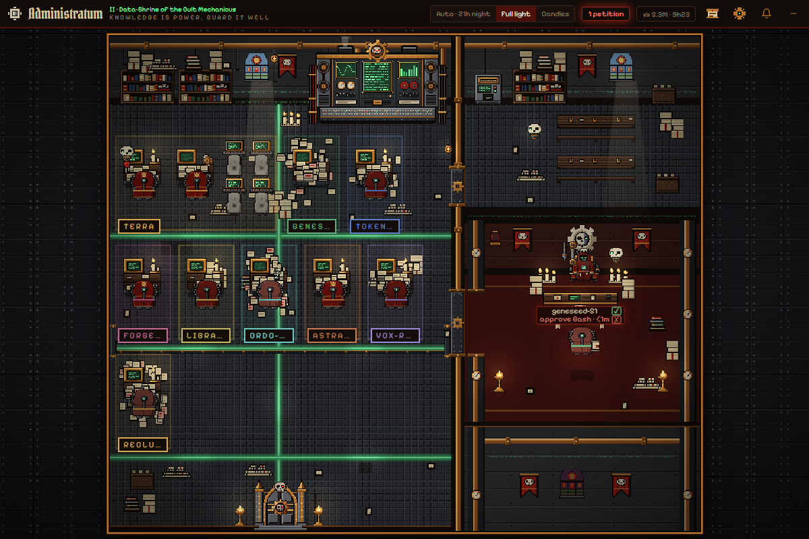
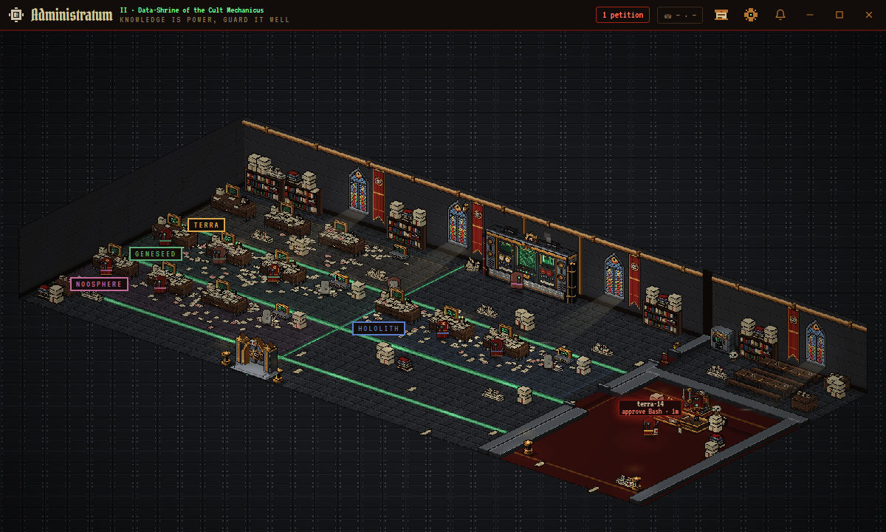
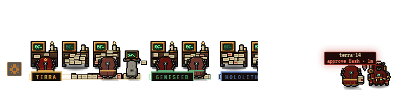
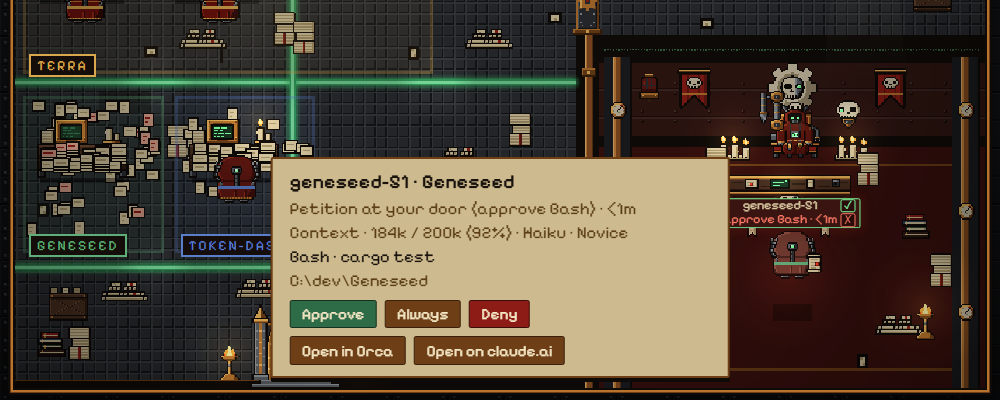
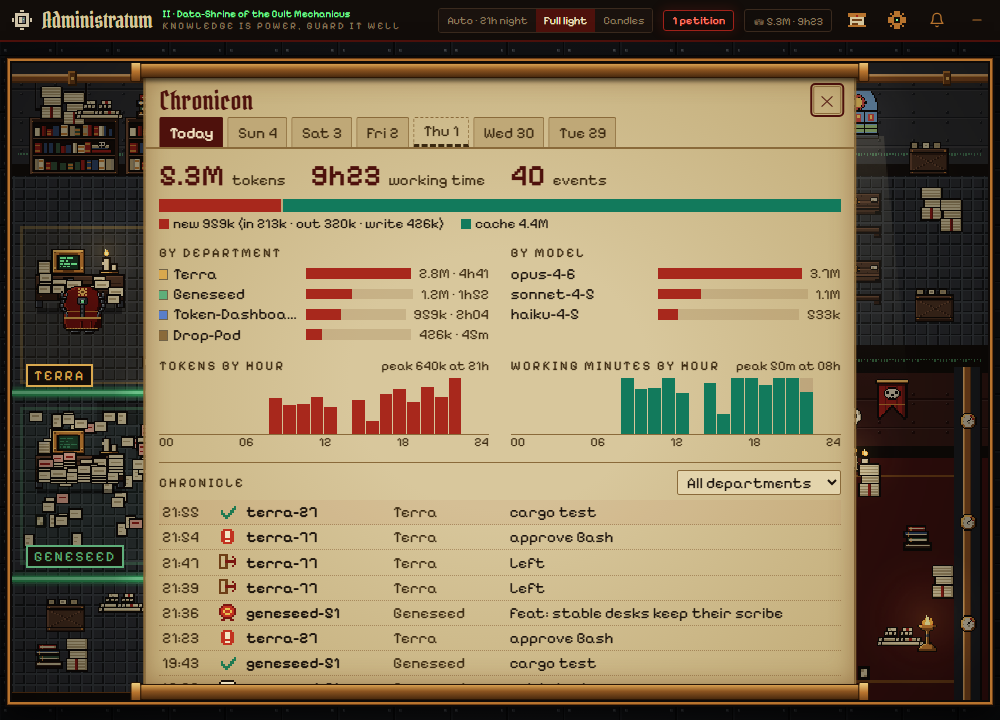
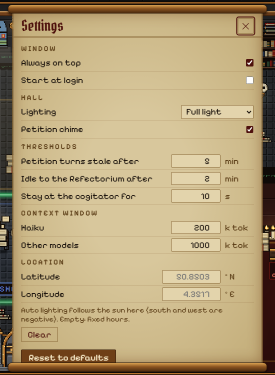

# Administratum

A Windows desktop widget that shows every Claude Code session on your PC as a tech-priest scribe in a pixel-art
Mechanicus scriptorium, and calls you when one of them needs an answer.



Administratum watches Claude Code's own session files and never writes to them. A session waiting on you
walks to the Sanctum and queues before the Magos. You get a Windows toast and an optional chime, and for
permission prompts in Orca terminals you can approve or deny from the widget itself.

**Quick start.** Install Claude Code, download the installer from the
[latest release](https://github.com/Arylmera/Administratum/releases/latest), run it, and start a Claude Code
session: its scribe walks in through the gate. To try it without any session, run the binary with `--demo`.

**Contents:** [What it shows](#what-it-shows) · [Install](#install) · [Usage](#usage) ·
[Remote view](#remote-view) · [Settings](#settings) · [Privacy and safety](#privacy-and-safety) ·
[Performance](#performance) · [Troubleshooting](#troubleshooting) · [Development](#development) ·
[Licenses](#licenses)

---

## What it shows

Each running Claude Code session is a **scribe**. Each project (the last segment of the session's working
directory) is a **department**, a coloured rug with its name on a plaque. A session's active subagents are its
**adepts**.

| You see | It means |
|---|---|
| Scribe at its desk, screen and candle lit | Session is working (`busy`) |
| Scribe at the cogitator bank (back wall) | Session is running a shell command. It stays there 10 s after the last one so quick Bash calls don't send it back and forth |
| Scribe dozing at the desk (`z z`), candle out | Turn done, waiting for your next prompt (`idle`) |
| Small brass cog turning on the desk corner | Idle, but a background shell it started is still running. The scribe stays at its desk |
| Scribe at the recaff dispenser, then asleep on a Refectorium bench | Idle for more than 2 min with no background shell. If every bench is taken, it dozes at its desk |
| Scribe queued in the Sanctum holding a sealed scroll, red label above it | **Petition**: the session is waiting on you. The label says what it wants (`approve Bash`, `input needed`...) and for how long |
| Scribe queued behind the petitioners with a question scroll, parchment label `question` | **Question**: the turn ended on a question to you. It queues like a petition, behind the real ones, with a toast and a softer chime; the header counter turns parchment-coloured when only questions wait. Both can be turned off in Settings > Petitions |
| Beacon on the Sanctum wall sweeping red, servo-skull hovering by the petitioner, header counter flashing | The petition has waited past the stale mark (5 min). You get a second toast and a different chime |
| Small grey figures at consoles in the department | **Adepts**: the session's active subagents, four consoles per desk slot. One leaves when the parent transcript reports it completed, or when its own transcript has been quiet for 10 min |
| Paper piled on the desk | The session's context. The desk is full at 50 % of the model's window. Past that, sheets fall around the desk and spread over the department floor. Red sheets from 90 % |
| Scribe carrying its pile to a brazier at the gate and burning it | **Compaction**: the session's context was compacted. If the scribe is away from its desk, the pile goes up in a puff instead |
| Gilded robe / plain red robe / faded robe | **Model rank**: Opus or Fable = *Magos*, Sonnet and others = *Tech-priest*, Haiku = *Novice*. Adepts carry the same marks |
| Scribe walking in through the grand gate / gathering papers and walking out | Session started / session ended |
| Purity seal stamped on a parchment on the desk (up to 3 stay) | A `git commit` succeeded |
| Servo-skull picks up a seal and flies out of the gate | A `git push` |
| Green lamp on the desk (20 s) / blinking red lamp | Test run passed / failed (`cargo test`, `npm test`, `npm run test`, `pnpm test`, `yarn test`, `pytest`, `vitest`, `jest`, `go test`) |
| Spark and smoke puff on the desk | A tool call returned an error |
| Scribe raises its scroll, gold glint, soft chime | A turn that took 5 min or more finished |
| Scribe stays at its desk under a `sealed · resets 14:00` tag | The session hit a subscription usage limit. One toast per wave: sessions sealed until the same hour share it. The tag goes at the reset hour or at the next prompt. The wording follows the theme (*throttled* in the cyberpunk den, *grounded* on the orbital station) |
| `✎5` by a working scribe's desk | Files the current turn has changed (Edit, Write, MultiEdit, NotebookEdit). The card lists them |

Adepts play a smaller version of these reactions at their console.

**Space.** A scribe keeps its desk. An empty desk is held 3 min for a newcomer from the same department, and
an empty department block stays 5 min, so a short restart doesn't reshuffle the hall. When the hall is full, desks
turn into compact lecterns (6 per row instead of 4). If that is still not enough, the hall grows downward by up to
6 bays. Only past that point does a `+N in the stacks` plaque appear. Their petitions still toast and count in the
header. The hall shrinks back once it has had room to spare for a minute.

**Lighting.** *Auto* follows the clock: day 08–18 h, dusk 06–08 h and 18–21 h, night otherwise. If you set a
latitude and longitude in Settings, *Auto* follows the real sun instead: civil dawn and dusk plus the half hour of
low sun count as dusk. The lighting choice lives in Settings > Hall: its *Auto* entry shows the hour and the phase
(`Auto · 22h night`), and its tooltip today's sunrise and sunset. *Full light* and *Candles* pin the day or night
look; the tray's *Cycle lighting* steps through the three. At night the hall is dark, apart from pools of light around the candles,
braziers, screens and coolant channels.

**Depth.** The hall is flat pixel art drawn to read as a volume: a soft shadow under everything that stands on the
floor, the floor darkened along the wall feet, shadows cast by the nearest lamp at night (by the window light by day),
light pools lying flat on the floor, a bright patch where each window beam meets the floor, walkers that bob,
servo-skulls with a shadow below them, a back wall that trails a little behind a pan, and the far end of the hall
slightly darker and greyer. No art changes: every effect is computed from the existing sprites.

**Views.** Settings > View switches the hall between three views, live:

- **Flat** (the default): the 3/4 pixel-art hall described above.
- **39°**: the same hall turned 39° and seen from above, the back wall receding 3:1 and the west wall 2:1. Walls,
  floors and props are real volumes: desks, shelves, crates and the cogitator are boxes, candles, drums and censers
  are cylinders, gauges and cog wheels are discs standing proud of their surface, screens sit recessed in a bezel.
  The inner walls are cut away to a low height so every room stays in view; the doorways keep their posts and lintel.
  Scribes and adepts walk in four diagonal facings and sit at their desks; everything is
  depth sorted by its floor footprint, with contact shadows, cast shadows at night and lights lifted off the floor
  (every desk-level glow sits at one shared desk height, its pool on the floor under it). At Auto scale the whole
  turned hall fits the window (smaller pixels); an explicit Scale pans, as in the flat view.

  

- **Desktop strip**: a thin, transparent, click-through bar pinned to the Windows taskbar, outlined pixel art
  over whatever is behind it. Left to right: a handle with its own small menu (Hall view, Settings, Chronicon,
  Hide), each department's lecterns and its adepts' consoles on a coloured mat with a name plaque, the cogitator,
  the recaff and bench where idle scribes nap, the petition line and the Magos at the right end. It is click-through
  everywhere except over a character, a label, a plaque, the handle and its open menu, or another open panel; a
  panel (card, Settings, Chronicon) opens by growing the window upward, above the strip. The strip hides itself
  while a fullscreen app has focus, and re-places itself when the taskbar, its monitor or its DPI changes. Strip
  size (S/M/L) and an optional backdrop are in Settings. Windows only for now, and only with a taskbar docked at
  the bottom of the screen (macOS, above the Dock, is not done yet).



Both views draw from one art source, and every world (Warhammer, Neon Grid, Orbital Station, Arcane Tower, Vault 111)
has its own 39° art. Every world also has a tall window on the back wall and full-height hangings (gothic window and
banners in the Warhammer themes, each other world its own design), in both views. The remote view keeps its own View.

**Header.** From left to right: petition counter, Tithe plaque (`⛁ tokens · working time` today), Chronicon,
Settings, a moon while quiet hours are on, mute chime, then the window buttons: **–** hides to the tray (the window
has no taskbar button), **□** maximizes and restores, **✕** quits. To move the window,
drag the header.

---

## Install

### Requirements

- Windows 10 or 11 (tested on Windows 11). Other platforms are not supported.
- Microsoft Edge WebView2 Runtime. It ships with Windows 11. On Windows 10 the installer fetches it if it is missing.
- [Claude Code](https://docs.anthropic.com/en/docs/claude-code) (tested with 2.1.283).
- Optional: Orca (tested with 1.4.220), needed to jump to a session's terminal and to answer
  petitions from the widget. The `orca` CLI must be on `PATH`, or installed at
  `%LOCALAPPDATA%\Programs\orca\resources\bin\orca.exe`.

### Installer

Download Administratum_<version>_x64-setup.exe from the [latest release](https://github.com/Arylmera/Administratum/releases/latest). Windows SmartScreen may say "unknown publisher" (the installer is not code-signed): More info > Run anyway. Later versions install from Settings > System > Updates.

Run the setup. On first launch the widget opens as a frameless, always-on-top 700 × 500 window with no taskbar
button. It lives in the system tray. Its position and size are remembered between runs.

To launch it at sign-in, turn on **Start at login** from the tray menu or from Settings. This is off by default.

---

## Usage

### Characters and the card

- **Hover** a character to see its name.
- **Click** a scribe or adept to open its card. If the session runs in an Orca terminal, that terminal is also
  brought to the front. Click again, press **Escape**, or click elsewhere to close the card.
- The card shows the scribe's name and department, state and time in state, context (`184k / 200k (92%)`),
  model and rank, the last task line, the turn (`Turn · 4 min · 23 tools · 5 files`, then the files it changed),
  and the project path. An adept's card shows its subagent type, its owner,
  model, context and task.
- **Open in Orca** switches Orca to the session's terminal. It is shown only for sessions started inside Orca,
  which Administratum detects from the `ORCA_TERMINAL_HANDLE` variable of the `claude.exe` process.
- **Open on claude.ai** opens the session's `https://claude.ai/code/...` page in your default browser. It is shown
  only when the session record carries a claude.ai session id.
- Clicking a petitioner also copies `name path` to the clipboard, so you can find the pane yourself.
- **Click a department's plaque** to open its folder (the most recently active session's working directory) in
  Explorer, VS Code or a command of your own (Settings > System). A branch other than `main` / `master` shows under
  the department's name, read from `.git/HEAD` (worktrees included).

### Answering petitions



When a petition is a **permission prompt** (`approve ...`) in an **Orca** terminal, the widget can answer it.
Use **✓ / ✗** on the queue label, or **Approve / Always / Deny** on the card. *Always* picks the prompt's first
"Yes, ..." option (don't ask again / allow all edits). If the prompt has no such option, it returns an error.

The petition toast itself carries **Approve** and **Deny** for the same prompts (permission, in Orca). A click runs
the same check below. If the petition was already answered in the terminal, nothing is typed. *Always* stays on the
card: on a toast it could be clicked without reading the prompt.

What happens when you click:

1. The backend runs `orca terminal read --terminal <handle> --screen --json` to read the terminal as currently
   rendered.
2. It checks that the screen really ends with a Claude Code permission dialog. That means the last
   `Do you want ...` line, followed by options numbered from 1, starting with a plain `Yes` and including a
   `No`, with nothing under them but a short footer. A dialog that has scrolled up under later output, or an
   input box below the options, does not count.
3. Only then does it run `orca terminal send --terminal <handle> --text <digit>`, typing the **single option
   digit** for your choice.

Nothing read from the screen is sent anywhere or shown back. Only that one digit is typed. If the check fails,
nothing is typed and the card says *No permission prompt visible — open the terminal*. Free-text petitions
(`input needed`, open dialogs) can't be answered from the widget. Use **Open in Orca** for those.

### Remote view

Watch the hall from a tablet or phone on the same network, in its browser:

1. Settings > Remote view > **Serve on the local network** (off by default; port 7770).
2. **Allow this port** adds the Windows Firewall rule (Windows asks for administrator permission).
3. Scan the QR code with the device's camera. It opens `http://<this PC>:7770/?t=<token>` and pairs the device;
   the link is then remembered in a cookie.

The remote page shows the same hall, cards and Chronicon, live. It keeps its own lighting, scale, theme, view and
chime; the PC's settings are shown read only. **Allow remote actions** (off by default) lets a paired device approve
or deny permission prompts, with the same on-screen check as on the PC; anyone with the link on your network can
then do it. *Open in Orca* and opening folders never run from a remote device. **Regenerate token** unpairs every
device. Only private and local network addresses are answered. The HTTP API is documented in
[docs/remote-api.md](docs/remote-api.md).

### Chronicon and Tithe



To unroll the Chronicon, click the scroll icon or the Tithe plaque in the header. It has one tab per day: today
and the 6 previous days. Each day shows:

- **Tithe**: tokens (new input/output vs. cache), working time (time sessions spent busy or in a shell),
  event count, tokens and time per department and per model, and 24-hour charts of tokens and working minutes.
- **Chronicle**: the event log, newest first. It covers commits, pushes, test passes and failures, tool errors,
  long tasks finished, arrivals, departures, petitions opened and answered, compactions and usage limits. You can filter it
  by department. While the Chronicon is open, new events appear at the top.

Tokens are counted once per assistant message. Subagent tokens count toward the parent's project. On first sight
of a transcript, only today's entries are read. Earlier days are not reconstructed.

To close the Chronicon, click ✕, press **Escape**, or click outside it.

### Settings



Open Settings with the gear in the header. Changes apply immediately. The panel has five tabs.

**Hall**

| Setting | Default | Effect |
|---|---|---|
| Lighting | Auto | Auto / Full light / Candles (see *Lighting* above) |
| Theme | Warhammer 40k | The world: Warhammer 40k, Cyberpunk, Space, Fantasy, Fallout. Each world outside 40k has its own art |
| Style | Ordo Administratum | A theme within the world: colours of the hall and the window, and the wording. Warhammer 40k: Ordo Administratum, Machinum, Xenos, Malleus, Hereticus. Cyberpunk: Neon Grid, Corpo Tower, Rain City, Green Code, Sunset Drive. Space: Orbital Station. Fantasy: Arcane Tower. Fallout: Vault 111 |
| View | Flat | Flat / 2.5D (the 39° view) / Desktop strip (Windows only; see *Views*) |
| Strip size *(strip only)* | M | S / M / L: pixel size of the desktop strip |
| Auto scale | on | Picks the pixel size from the window. Off: the *Scale* slider (1–3) sets it, and a hall larger than the window pans |
| Strip backdrop *(strip only)* | off | A translucent band behind the strip, for readability over a busy wallpaper |
| Backdrop *(2.5D only)* | on | The riveted backdrop around the turned hall. Off: the desktop shows around it |
| Latitude / Longitude | empty | Where *Auto* lighting takes its sun (south and west are negative). Empty = fixed hours |

**Petitions**

| Setting | Default | Effect |
|---|---|---|
| Petition chime | on | Chime on a new petition, a stale one, a question and a long task done (the header bell toggles it too) |
| A question at the end of a turn counts as a petition | on | The scribe queues in the Sanctum with a question scroll |
| Toast for questions | on | A Windows toast for each new question |
| Petition turns stale after | 5 min (1–120) | Stale escalation: beacon, servo-skull, second toast |
| Quiet hours | off, 22:00–08:00 | No toast and no chime for a new petition, question, long task or usage limit inside the window. A petition turning stale still toasts and chimes. A moon shows in the header while it is quiet |

**Scribes**

| Setting | Default | Effect |
|---|---|---|
| Idle to the Refectorium after | 2 min (1–120) | How long a scribe stays idle at its desk before it goes to nap |
| Stay at the cogitator for | 10 s (0–120) | How long a scribe stays at the cogitator after its last shell command |
| Context window: Haiku | 200 k tokens | Window used for the context fill of Haiku sessions |
| Context window: Other models | 1000 k tokens | Window for every other model |

**System**

| Setting | Default | Effect |
|---|---|---|
| Always on top | on | Keeps the window above others |
| Start at login | off | Starts the app at sign-in (same as the tray item) |
| Pause when hidden or covered | on | Stops drawing while the window is minimised, hidden to the tray or fully covered (checked every 2 s); toasts still fire |
| Idle frame rate | 12 fps | 6 / 8 / 12 / 30: redraw rate while nothing moves (anything walking or animating runs at 30 fps). Lower = less CPU/GPU |
| Open departments with | Explorer | Explorer / VS Code / Custom command. A custom command gets the folder as one argument (`{path}`, else appended) and never runs through a shell |
| Check for updates at startup | on | Fetches `latest.json` from GitHub Releases at start. *Check now* checks on demand; an update installs from here |

**Remote view**: see [Remote view](#remote-view).

**Reset to defaults** restores every value above except *Start at login*.

### Tray menu

| Item | Action |
|---|---|
| Show / hide | Toggle the window (the header's `–` button also hides it) |
| Toggle chime | Mute / unmute |
| Cycle lighting | Auto → Full light → Candles |
| Desktop strip | Checkbox (Windows only): switches between the strip and the view held before it |
| Start at login | Checkbox, kept in sync with Settings |
| Quit | Exit Administratum |

### Keyboard and panning

When the window is too small to show the whole hall at a readable size, the view pans:

- **Drag** the scene (click, hold and move more than a few pixels). Let go while moving and the view coasts.
- **Arrow keys** pan in steps.
- **Double-click** the scene to recentre it.
- An **arrow on an edge** of the view counts the characters beyond that edge. It blinks red if one of them is
  petitioning. Click it to glide to that petitioner, or to the nearest character if none is petitioning.
- **Escape** closes the card, the Chronicon or Settings.

---

## Privacy and safety

**Read-only towards Claude Code.** Administratum never writes to `~/.claude`, never changes Claude Code's
configuration, and installs no hooks. It reads:

| What | Why |
|---|---|
| `~/.claude/sessions/*.json` | The live session list: name, working directory, status, what a petition waits for |
| `~/.claude/projects/<project>/<sessionId>.jsonl` | The tail for the task line, context size, model and compaction marker. Appended bytes for Chronicon events and token usage |
| `.../<sessionId>/subagents/agent-*.jsonl` and `agent-*.meta.json` | Active subagents: type, task, model, context |
| `ORCA_TERMINAL_HANDLE` in the environment of running `claude.exe` processes | Which Orca terminal a session lives in. Read once per process |
| Process name and start time of each session's pid | Whether the session is still alive (guards against pid reuse) |
| `.git/HEAD` in or above each session's working directory (following a worktree's `.git` file) | The branch shown under the department plaque. Read directly, git is never run |

**What it writes, and where.** Everything goes under `%APPDATA%\com.arylmera.administratum\`:

| Path | Content |
|---|---|
| `settings.json` | UI settings (the tables above) and the remote view's port, switches and pairing token. The WebView's local storage holds only a cache |
| `chronicon\YYYY-MM-DD.jsonl` | That day's events: time, kind, session name, department, short detail (commit subject, test command, tool name...) |
| `chronicon\YYYY-MM-DD.tithe.json` | That day's token and working-time totals |
| `chronicon\offsets.json` | How far each transcript has been read |

Chronicon files older than 7 days are deleted at startup. Demo mode uses a separate `chronicon-demo\` folder,
which is wiped at each start.

**Nothing about your sessions leaves the machine**, unless you turn on the [remote view](#remote-view), which serves
the hall to paired devices on your local network only. There is no telemetry. The only network call is the update
check: it fetches `latest.json` from the project's GitHub Releases at startup (Settings > System > Updates, can be
turned off) and when you click *Check now*. The only other outbound action is opening a `https://claude.ai/code/<id>`
link in your browser when you click *Open on claude.ai*. That URL is validated (fixed prefix, id limited to letters, digits, `_` and `-`) before it is passed to the shell.

**Answering petitions.** This is the only action that affects a session, and it only types one digit into an
Orca terminal after you click, in the widget or on a toast. The safeguards:

- The terminal handle is validated (`term_` followed by hex digits and dashes).
- Arguments go straight to the `orca` process, never through a shell.
- The digit is typed only after the rendered screen has been checked as described [above](#answering-petitions).
- Screen contents are never echoed, logged or sent.
- Errors are fixed strings.
- A toast's button only acts while the petition it was raised for is still open (same session, same episode).
  Answered in the terminal already, or gone: nothing is typed.

**Opening a department's folder.** A plaque click starts Explorer, VS Code or your custom command, and only for the
working directory of a session currently in the hall. The folder is passed as one argument, never through a shell.
The remote view cannot do it, and never receives the custom command.

---

## Performance

Measured on Windows 11 with a release build at rest:

- Backend: about **0.1 % CPU**. It polls once a second, checks liveness with one Win32 process handle per
  session pid, re-reads a transcript tail only when the file's size or modification time changed, and streams
  appended transcript lines from a stored offset.
- Rendering: about **7–8 % of one core** for the WebView2 canvas. The scene draws at 30 fps while anything
  moves and 12 fps at rest, and stops drawing while the window is hidden.
- Installer: about **1.9 MB**.

---

## Troubleshooting

| Symptom | Check |
|---|---|
| No toasts for petitions | Windows notifications are off for Administratum, or Focus / Do not disturb is on. Check *Settings → System → Notifications* |
| "No scribes on duty" while sessions are running | Administratum reads `%USERPROFILE%\.claude\sessions\`. Check that folder exists and holds `<pid>.json` files while Claude Code runs. Sessions of another Windows user or on another machine are not seen |
| No **Open in Orca** button, or ✓ / ✗ missing on a petition | The session was not started in an Orca terminal (no `ORCA_TERMINAL_HANDLE`), or the `orca` CLI is not found. Answer buttons also appear only for permission prompts, not free-text questions |
| "No permission prompt visible — open the terminal" | The dialog is no longer at the bottom of the terminal screen (answered elsewhere, scrolled, or a different prompt). Use **Open in Orca** |
| Settings and Chronicon history gone after reinstalling | The uninstaller was run with its *delete the application data* option, which removes `%APPDATA%\com.arylmera.administratum`. A normal uninstall or reinstall keeps them |
| Context fill looks wrong | Set the context window for the model family in Settings (for example 200 k for a 200 k-window model) |
| Remote view: the iPad / phone page stays blank or never loads | The Windows Firewall drops the connection. Open **Settings → Remote view → Allow this port** (Windows asks for administrator permission); the line under the port says whether the rule is in place. If it says your network is *Public*, mark it *Private* (`Set-NetConnectionProfile -InterfaceAlias "Ethernet" -NetworkCategory Private`, admin PowerShell). Fallback, by hand in an admin PowerShell: `New-NetFirewallRule -DisplayName "Administratum remote view" -Direction Inbound -Program "$env:LOCALAPPDATA\Administratum\administratum.exe" -Protocol TCP -LocalPort 7770 -RemoteAddress LocalSubnet -Action Allow -Profile Private`. Use the `192.168.x.x` address, not a virtual adapter's (`172.x` WSL/Hyper-V) |
| Remote view: a red box at the bottom of the page | The page reports its own JavaScript errors there (remote browsers have no console); it includes the browser version |

---

## Development

Tauri 2 app: a Rust backend in `src-tauri/`, a UI of plain ES modules in `ui/` with no build step.

```sh
cd src-tauri && cargo tauri dev                      # run (ADMINISTRATUM_DEMO=1 for a scripted demo roster)
cargo test --manifest-path src-tauri/Cargo.toml      # backend tests
for t in ui/*.test.mjs; do node "$t"; done           # UI checks (plain assert scripts)
```

[docs/DEVELOPMENT.md](docs/DEVELOPMENT.md) covers the architecture and every module, tests, the sprite and theme
pipeline with its live viewer, building the installer and releasing. [docs/](docs/README.md) indexes the design
specs, plans and the [backlog](docs/backlog.md).

---

## Licenses

**Administratum**: [MIT](LICENSE), © 2026 Guillaume Lemer (Arylmera). The licence covers this project's code and art only.

**Fonts** (bundled in `ui/fonts/`, under the SIL Open Font License 1.1):

| Font | Files | Licence |
|---|---|---|
| Pirata One, © 2012 Rodrigo Fuenzalida, Nicolas Massi | `pirata-one-latin.woff2` | `OFL-PirataOne.txt` |
| VT323, © 2011 The VT323 Project Authors | `vt323-latin.woff2`, `vt323-latin-ext.woff2` | `OFL-VT323.txt` |

Warhammer 40,000 and the Adeptus Mechanicus are trademarks of Games Workshop. Administratum is an unofficial fan
project and is not affiliated with or endorsed by Games Workshop.
