# Sprites — Tier II — Data-Shrine

Generated by `node tools/sprite_sheet.mjs --theme tier2` from the art files in `ui/art/` and the palette in `ui/theme.js`. Do not edit by hand.
Each image is 4× the art pixels (the art is 2× the logical scene pixels). Sizes are logical px.

To discuss a sprite, open a **Sprite** issue (New issue → Sprite) and paste the sprite id; see
[the design note](../superpowers/specs/2026-10-06-sprite-themes-design.md#discussing-sprites).

## Scribe (one per session)

| Sprite | Logical size | Notes | Image |
|---|---|---|---|
| `SCRIBE.high.down` | 16×17 | Magos (opus), walking down, 3 frames. Source: `ui/art/scribe.png` | 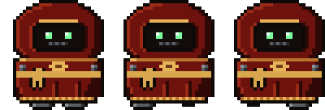 |
| `SCRIBE.high.up` | 16×17 | Magos (opus), walking up, 3 frames. Source: `ui/art/scribe.png` | 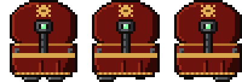 |
| `SCRIBE.high.right` | 16×17 | Magos (opus), walking right, 3 frames. Source: `ui/art/scribe.png` | 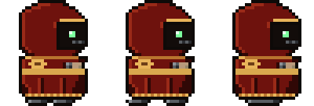 |
| `SCRIBE.high.left` | 16×17 | Magos (opus), walking left, 3 frames. Source: `ui/art/scribe.png` | 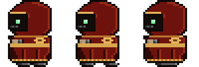 |
| `SCRIBE.standard.down` | 16×17 | Tech-priest (sonnet), walking down, 3 frames. Source: `ui/art/scribe.png` | 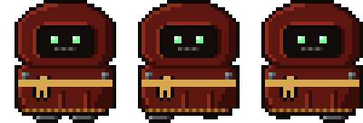 |
| `SCRIBE.standard.up` | 16×17 | Tech-priest (sonnet), walking up, 3 frames. Source: `ui/art/scribe.png` | 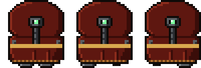 |
| `SCRIBE.standard.right` | 16×17 | Tech-priest (sonnet), walking right, 3 frames. Source: `ui/art/scribe.png` | 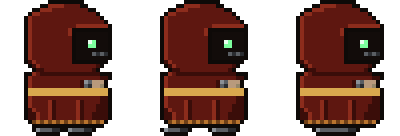 |
| `SCRIBE.standard.left` | 16×17 | Tech-priest (sonnet), walking left, 3 frames. Source: `ui/art/scribe.png` | 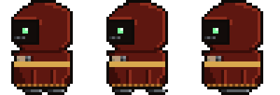 |
| `SCRIBE.novice.down` | 16×17 | Novice (haiku), walking down, 3 frames. Source: `ui/art/scribe.png` | 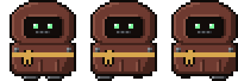 |
| `SCRIBE.novice.up` | 16×17 | Novice (haiku), walking up, 3 frames. Source: `ui/art/scribe.png` | 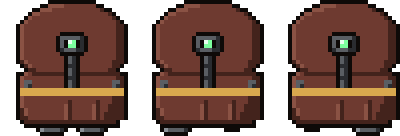 |
| `SCRIBE.novice.right` | 16×17 | Novice (haiku), walking right, 3 frames. Source: `ui/art/scribe.png` | 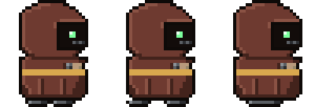 |
| `SCRIBE.novice.left` | 16×17 | Novice (haiku), walking left, 3 frames. Source: `ui/art/scribe.png` | 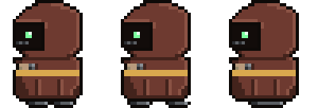 |
| `SCRIBE.sashes` | 16×17 | Department colours (theme sash), one per project | 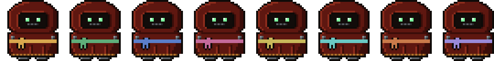 |

## Adept (one per subagent)

| Sprite | Logical size | Notes | Image |
|---|---|---|---|
| `ADEPT.high.down` | 12×14 | Magos adept, walking down, 3 frames. Source: `ui/art/adept.png` | 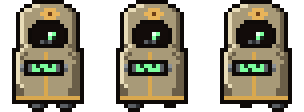 |
| `ADEPT.high.up` | 12×14 | Magos adept, walking up, 3 frames. Source: `ui/art/adept.png` | 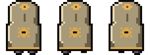 |
| `ADEPT.high.right` | 12×14 | Magos adept, walking right, 3 frames. Source: `ui/art/adept.png` | 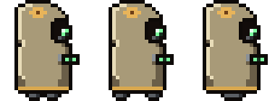 |
| `ADEPT.high.left` | 12×14 | Magos adept, walking left, 3 frames. Source: `ui/art/adept.png` | 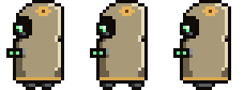 |
| `ADEPT.standard.down` | 12×14 | Tech-priest adept, walking down, 3 frames. Source: `ui/art/adept.png` | 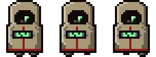 |
| `ADEPT.standard.up` | 12×14 | Tech-priest adept, walking up, 3 frames. Source: `ui/art/adept.png` | 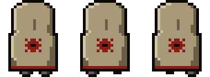 |
| `ADEPT.standard.right` | 12×14 | Tech-priest adept, walking right, 3 frames. Source: `ui/art/adept.png` | 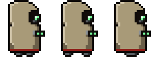 |
| `ADEPT.standard.left` | 12×14 | Tech-priest adept, walking left, 3 frames. Source: `ui/art/adept.png` | 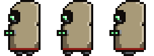 |
| `ADEPT.novice.down` | 12×14 | Novice adept, walking down, 3 frames. Source: `ui/art/adept.png` | 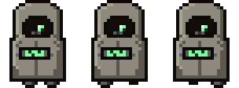 |
| `ADEPT.novice.up` | 12×14 | Novice adept, walking up, 3 frames. Source: `ui/art/adept.png` | 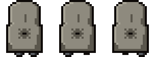 |
| `ADEPT.novice.right` | 12×14 | Novice adept, walking right, 3 frames. Source: `ui/art/adept.png` | 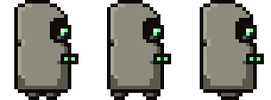 |
| `ADEPT.novice.left` | 12×14 | Novice adept, walking left, 3 frames. Source: `ui/art/adept.png` | 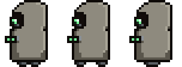 |

## Magos (on the throne)

| Sprite | Logical size | Notes | Image |
|---|---|---|---|
| `MAGOS` | 24×24 | Seated Magos: the drill arm swings, the chest screen scans, the optics pulse. Source: `ui/art/magos.png` (body and arm frames) | 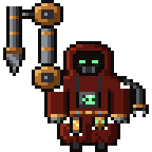 |
| `MAGOS.arm` | 5×24 | The drill forearm, its own frame so it can swing. Source: `ui/art/magos.png` | 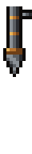 |

## Props and furniture

| Sprite | Logical size | Notes | Image |
|---|---|---|---|
| `ARM` | 4×8 | Scribe's right arm at the desk (raised with the scroll when a long turn finishes). Source: `ui/art/scribe.png`, drawn by actors.js | 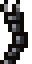 |
| `ARM_L` | 4×8 | Scribe's left arm at the desk. Source: `ui/art/scribe.png`, drawn by actors.js | 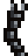 |
| `DESK` | 32×21 | Scribe's desk: screen and candle lit while busy. Source: `ui/art/workstations.png`, drawn by scene.js | 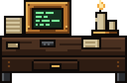 |
| `DESK.unlit` | 32×21 | DESK, unlit | 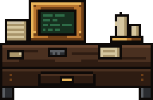 |
| `LECTERN` | 22×21 | Compact desk once the hall is full (6 a row). Source: `ui/art/workstations.png`, drawn by scene.js | 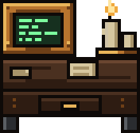 |
| `LECTERN.unlit` | 22×21 | LECTERN, unlit | 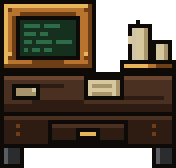 |
| `CONSOLE` | 14×10 | Adept console, one per subagent. Source: `ui/art/workstations.png`, drawn by scene.js | 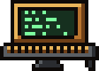 |
| `CONSOLE.unlit` | 14×10 | CONSOLE, unlit | 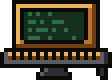 |
| `COGITATOR` | 82×50 | Cogitator bank on the back wall: where shell commands run. Source: `ui/art/cogitator.png`, drawn by scene.js | 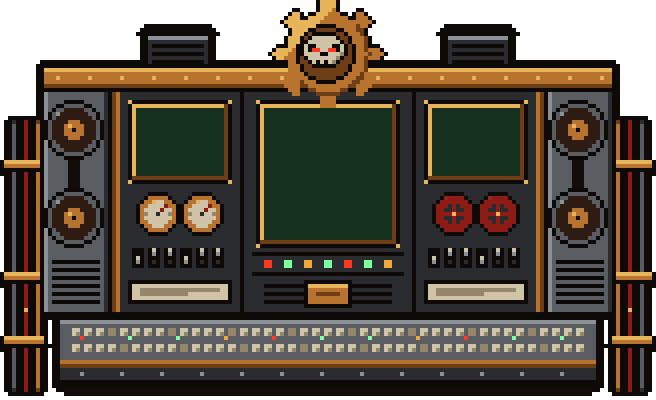 |
| `THRONE` | 20×20 | The Magos's throne (Sanctum). Source: `ui/art/sanctum.png`, drawn by scene.js | 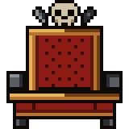 |
| `LORD_DESK` | 44×13 | The Magos's desk, petitions queue before it. Source: `ui/art/sanctum.png`, drawn by scene.js | 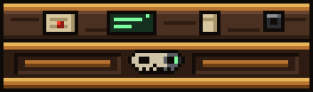 |
| `COG_MECH` | 20×18 | Cog Mechanicus above the throne. Source: `ui/art/sanctum.png`, drawn by scene.js | 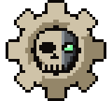 |
| `SEAL` | 6×10 | Purity seals on the lord desk. Source: `ui/art/sanctum.png`, drawn by scene.js | 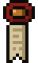 |
| `GATE` | 32×30 | Grand gate frame: sessions enter and leave here. Source: `ui/art/gate.png`, drawn by scene.js | 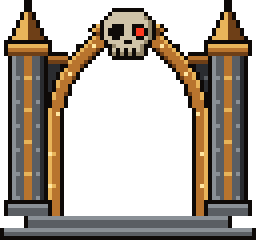 |
| `GATE_L` | 8×22 | Grand gate, left leaf (slides open). Source: `ui/art/gate.png`, drawn by scene.js | 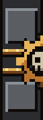 |
| `GATE_R` | 8×22 | Grand gate, right leaf (slides open). Source: `ui/art/gate.png`, drawn by scene.js | 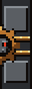 |
| `GATE_VOID` | 16×22 | ?. Source: `ui/art/gate.png`, drawn by scene.js | 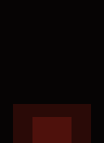 |
| `RECAFF` | 16×18 | Recaff dispenser (Refectorium), first stop of an idle scribe. Source: `ui/art/refectorium.png`, drawn by scene.js | 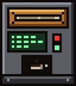 |
| `TABLE` | 46×8 | Refectorium table. Source: `ui/art/refectorium.png`, drawn by scene.js | 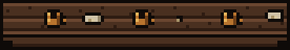 |
| `BENCH` | 46×4 | Refectorium bench: long-idle scribes sleep here. Source: `ui/art/refectorium.png`, drawn by scene.js | 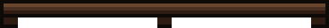 |
| `WINDOW` | 16×17 | Window: day or night glass, casts a beam by day. Source: `ui/art/walls.png`, drawn by scene.js, theme.js | 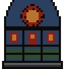 |
| `WINDOW.day` | 16×17 | WINDOW, day | 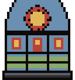 |
| `WINDOW.night` | 16×17 | WINDOW, night | 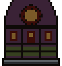 |
| `BANNER` | 12×15 | Wall banner. Source: `ui/art/walls.png`, drawn by scene.js |  |
| `SHELF` | 32×21 | Bookshelf on the back wall. Source: `ui/art/walls.png`, drawn by scene.js |  |
| `GAUGE` | 6×6 | Pressure gauge on the Sanctum pillars. Source: `ui/art/walls.png`, drawn by scene.js |  |
| `CENSER` | 5×10 | Censer. Source: `ui/art/walls.png`, drawn by scene.js |  |
| `PAPER_STACK` | 8×12 | Paper tower (decor). Source: `ui/art/clutter.png`, drawn by scene.js |  |
| `SCROLL_PILE` | 18×7 | Scroll pile (decor). Source: `ui/art/clutter.png`, drawn by scene.js |  |
| `BOOKS` | 10×9 | Book pile (decor). Source: `ui/art/clutter.png`, drawn by scene.js |  |
| `LOOSE_A` | 5×4 | Loose sheet on the floor (decor). Source: `ui/art/clutter.png`, drawn by scene.js |  |
| `LOOSE_B` | 4×5 | Loose sheet on the floor (decor). Source: `ui/art/clutter.png`, drawn by scene.js |  |
| `CRATE` | 14×12 | Supply crate. Source: `ui/art/clutter.png`, drawn by scene.js |  |
| `SKULL` | 10×10 | Servo-skull: perched by the Magos, courier on git push, red-eyed over a stale petition. Source: `ui/art/skull.png`, drawn by scene.js |  |
| `SKULL.alarm` | 10×10 | SKULL, alarm |  |
| `SCROLL` | 6×7 | Sealed petition scroll, held while queued in the Sanctum. Source: `ui/art/petitions.png`, drawn by actors.js |  |
| `QSCROLL` | 6×7 | Question scroll: the turn ended with a question. Source: `ui/art/petitions.png`, drawn by actors.js |  |
| `SCROLL_HELD` | 14×7 | The finished scroll a scribe raises when a long turn is done. Source: `ui/art/petitions.png`, drawn by actors.js |  |
| `BRAZIER` | 10×13 | Brazier at the gate and in the Sanctum; compaction burns here. Source: `ui/art/fire.png`, drawn by scene.js |  |
| `CANDLES` | 12×9 | Candle cluster. Source: `ui/art/fire.png`, drawn by scene.js |  |
| `COMMIT_SEAL` | 4×7.5 | Purity seal hung on the desk for each commit (up to 3). Source: `ui/art/commits.png`, drawn by scene.js |  |
| `COMMIT_TAG` | 4×7.5 | The seal's strips before the wax lands. Source: `ui/art/commits.png`, drawn by scene.js |  |
| `COMMIT_STAMP` | 4×6 | The stamp that seals a commit. Source: `ui/art/commits.png`, drawn by scene.js |  |

## Room tiles

| Sprite | Logical size | Notes | Image |
|---|---|---|---|
| `ROOM.floor` | 12×12 | `floor`: repeats both ways (shown repeated). Source: `ui/art/room-floor.png` |  |
| `ROOM.channel_h` | 24×2 | `channel h`: repeats along x, glows (coolant) (shown repeated). Source: `ui/art/room-floor.png` |  |
| `ROOM.channel_v` | 2×24 | `channel v`: repeats along y, glows (coolant) (shown repeated). Source: `ui/art/room-floor.png` |  |
| `ROOM.sanctum_passage` | 6×6 | `sanctum passage`: repeats both ways (shown repeated). Source: `ui/art/room-floor.png` |  |
| `ROOM.sill` | 72×2 | `sill`: repeats along x (shown repeated). Source: `ui/art/room-floor.png` |  |
| `ROOM.sanctum_floor` | 20×20 | `sanctum floor`: nine-slice (corners kept, edges and centre repeat). Source: `ui/art/room-floor.png` |  |
| `ROOM.wall_top` | 12×10 | `wall top`: drawn as is. Source: `ui/art/room-walls.png` |  |
| `ROOM.wall` | 36×30 | `wall`: repeats both ways, first row from `wall top` (shown repeated). Source: `ui/art/room-walls.png` |  |
| `ROOM.wall_east_top` | 12×10 | `wall east top`: drawn as is. Source: `ui/art/room-walls.png` |  |
| `ROOM.wall_east` | 36×30 | `wall east`: repeats both ways, first row from `wall east top` (shown repeated). Source: `ui/art/room-walls.png` |  |
| `ROOM.wall_sanctum_top` | 12×10 | `wall sanctum top`: drawn as is. Source: `ui/art/room-walls.png` |  |
| `ROOM.wall_sanctum` | 36×30 | `wall sanctum`: repeats both ways, first row from `wall sanctum top` (shown repeated). Source: `ui/art/room-walls.png` |  |
| `ROOM.wall_foot` | 6×6 | `wall foot`: repeats both ways (shown repeated). Source: `ui/art/room-walls.png` |  |
| `ROOM.wall_dark` | 6×6 | `wall dark`: repeats both ways (shown repeated). Source: `ui/art/room-walls.png` |  |
| `ROOM.wall_base` | 12×3 | `wall base`: repeats along x (shown repeated). Source: `ui/art/room-walls.png` |  |
| `ROOM.sanctum_base` | 12×3 | `sanctum base`: repeats along x (shown repeated). Source: `ui/art/room-walls.png` |  |
| `ROOM.pillar` | 10×24 | `pillar`: repeats along y (shown repeated). Source: `ui/art/room-walls.png` |  |
| `ROOM.pilaster` | 4×19.5 | `pilaster`: drawn as is. Source: `ui/art/room-walls.png` |  |
| `ROOM.beacon_off` | 7×10 | `beacon off`: drawn as is. Source: `ui/art/room-walls.png` |  |
| `ROOM.beacon_on` | 7×10 | `beacon on`: drawn as is. Source: `ui/art/room-walls.png` |  |
| `ROOM.beacon_cage` | 7×10 | `beacon cage`: drawn as is. Source: `ui/art/room-walls.png` |  |
| `ROOM.pipe_h` | 24×3 | `pipe h`: repeats along x (shown repeated). Source: `ui/art/room-pipes.png` |  |
| `ROOM.pipe_v` | 3×24 | `pipe v`: repeats along y (shown repeated). Source: `ui/art/room-pipes.png` |  |
| `ROOM.fitting_h` | 3×5 | `fitting h`: drawn as is. Source: `ui/art/room-pipes.png` |  |
| `ROOM.fitting_v` | 5×3 | `fitting v`: drawn as is. Source: `ui/art/room-pipes.png` |  |
| `ROOM.fitting_wide` | 10×2 | `fitting wide`: drawn as is. Source: `ui/art/room-pipes.png` |  |
| `ROOM.door_sanctum_closed` | 10×40 | `door sanctum closed`: drawn as is. Source: `ui/art/room-doors.png` |  |
| `ROOM.door_sanctum_open` | 10×40 | `door sanctum open`: drawn as is. Source: `ui/art/room-doors.png` |  |
| `ROOM.door_refectory_closed` | 10×24 | `door refectory closed`: drawn as is. Source: `ui/art/room-doors.png` |  |
| `ROOM.door_refectory_open` | 10×24 | `door refectory open`: drawn as is. Source: `ui/art/room-doors.png` |  |
