# Sprites — Orbital Station

Generated by `node tools/sprite_sheet.mjs --theme orbital` from the art files in `ui/art/` and the palette in `ui/theme.js`. Do not edit by hand.
Each image is 4× the art pixels (the art is 2× the logical scene pixels). Sizes are logical px.

To browse every theme side by side, animated and zoomable, open the live viewer `tools/sprites.html` (see its header).
To discuss a sprite, open a **Sprite** issue (New issue → Sprite) and paste the sprite id; see
[the design note](../superpowers/specs/2026-10-06-sprite-themes-design.md#discussing-sprites).

## Scribe (one per session)

| Sprite | Logical size | Notes | Image |
|---|---|---|---|
| `SCRIBE.high.down` | 16×17 | Commander (opus), walking down, 3 frames. Source: `ui/art/orbital/scribe.png` | 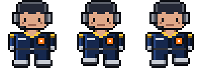 |
| `SCRIBE.high.up` | 16×17 | Commander (opus), walking up, 3 frames. Source: `ui/art/orbital/scribe.png` | 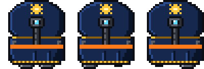 |
| `SCRIBE.high.right` | 16×17 | Commander (opus), walking right, 3 frames. Source: `ui/art/orbital/scribe.png` | 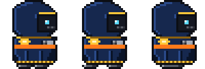 |
| `SCRIBE.high.left` | 16×17 | Commander (opus), walking left, 3 frames. Source: `ui/art/orbital/scribe.png` | 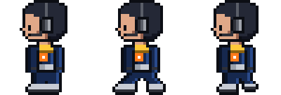 |
| `SCRIBE.standard.down` | 16×17 | Astronaut (sonnet), walking down, 3 frames. Source: `ui/art/orbital/scribe.png` | 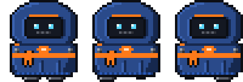 |
| `SCRIBE.standard.up` | 16×17 | Astronaut (sonnet), walking up, 3 frames. Source: `ui/art/orbital/scribe.png` | 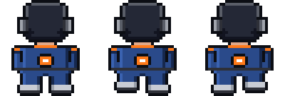 |
| `SCRIBE.standard.right` | 16×17 | Astronaut (sonnet), walking right, 3 frames. Source: `ui/art/orbital/scribe.png` | 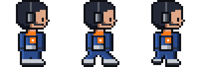 |
| `SCRIBE.standard.left` | 16×17 | Astronaut (sonnet), walking left, 3 frames. Source: `ui/art/orbital/scribe.png` | 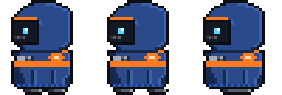 |
| `SCRIBE.novice.down` | 16×17 | Cadet (haiku), walking down, 3 frames. Source: `ui/art/orbital/scribe.png` | 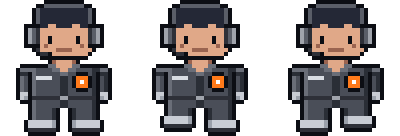 |
| `SCRIBE.novice.up` | 16×17 | Cadet (haiku), walking up, 3 frames. Source: `ui/art/orbital/scribe.png` | 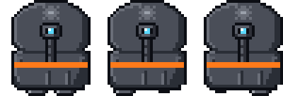 |
| `SCRIBE.novice.right` | 16×17 | Cadet (haiku), walking right, 3 frames. Source: `ui/art/orbital/scribe.png` | 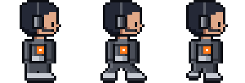 |
| `SCRIBE.novice.left` | 16×17 | Cadet (haiku), walking left, 3 frames. Source: `ui/art/orbital/scribe.png` | 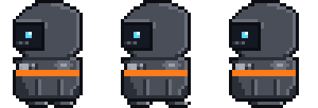 |
| `SCRIBE.sashes` | 16×17 | Department colours (theme sash), one per project. Source: `ui/art/orbital/scribe.png` | 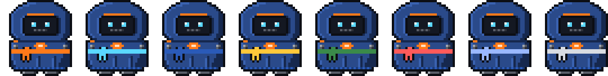 |

## Adept (one per subagent)

| Sprite | Logical size | Notes | Image |
|---|---|---|---|
| `ADEPT.high.down` | 12×14 | Commander adept, walking down, 3 frames. Source: `ui/art/orbital/adept.png` | 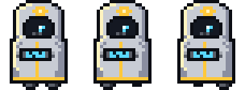 |
| `ADEPT.high.up` | 12×14 | Commander adept, walking up, 3 frames. Source: `ui/art/orbital/adept.png` | 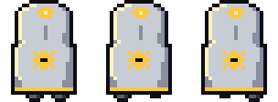 |
| `ADEPT.high.right` | 12×14 | Commander adept, walking right, 3 frames. Source: `ui/art/orbital/adept.png` | 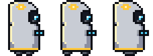 |
| `ADEPT.high.left` | 12×14 | Commander adept, walking left, 3 frames. Source: `ui/art/orbital/adept.png` | 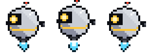 |
| `ADEPT.standard.down` | 12×14 | Astronaut adept, walking down, 3 frames. Source: `ui/art/orbital/adept.png` | 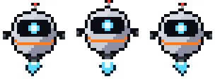 |
| `ADEPT.standard.up` | 12×14 | Astronaut adept, walking up, 3 frames. Source: `ui/art/orbital/adept.png` | 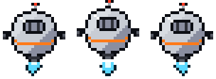 |
| `ADEPT.standard.right` | 12×14 | Astronaut adept, walking right, 3 frames. Source: `ui/art/orbital/adept.png` | 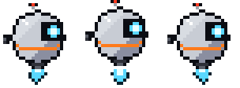 |
| `ADEPT.standard.left` | 12×14 | Astronaut adept, walking left, 3 frames. Source: `ui/art/orbital/adept.png` | 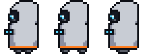 |
| `ADEPT.novice.down` | 12×14 | Cadet adept, walking down, 3 frames. Source: `ui/art/orbital/adept.png` | 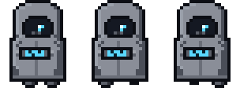 |
| `ADEPT.novice.up` | 12×14 | Cadet adept, walking up, 3 frames. Source: `ui/art/orbital/adept.png` | 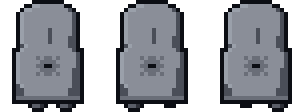 |
| `ADEPT.novice.right` | 12×14 | Cadet adept, walking right, 3 frames. Source: `ui/art/orbital/adept.png` | 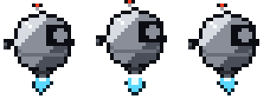 |
| `ADEPT.novice.left` | 12×14 | Cadet adept, walking left, 3 frames. Source: `ui/art/orbital/adept.png` | 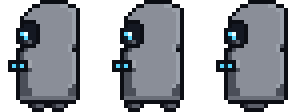 |

## Magos (on the throne)

| Sprite | Logical size | Notes | Image |
|---|---|---|---|
| `MAGOS` | 24×24 | Seated Magos: the drill arm swings, the chest screen scans, the optics pulse (body and arm frames). Source: `ui/art/orbital/magos.png` | 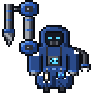 |
| `MAGOS.arm` | 5×24 | The drill forearm, its own frame so it can swing. Source: `ui/art/orbital/magos.png` |  |

## 39° characters

| Sprite | Logical size | Notes | Image |
|---|---|---|---|
| `SCRIBE39.E` | 16×17 | SCRIBE39, 39° view, walking E, 3 frames. Source: `ui/art/orbital/scribe39.png` | 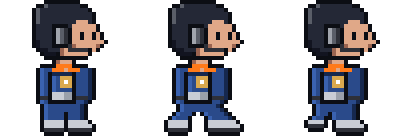 |
| `SCRIBE39.W` | 16×17 | SCRIBE39, 39° view, walking W, 3 frames. Source: `ui/art/orbital/scribe39.png` | 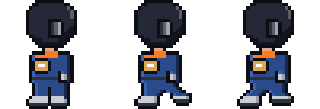 |
| `SCRIBE39.S` | 16×17 | SCRIBE39, 39° view, walking S, 3 frames. Source: `ui/art/orbital/scribe39.png` | 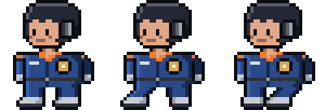 |
| `SCRIBE39.N` | 16×17 | SCRIBE39, 39° view, walking N, 3 frames. Source: `ui/art/orbital/scribe39.png` | 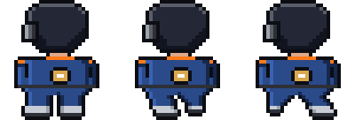 |
| `SCRIBE39.arm` | 5×8 | SCRIBE39, arm. Source: `ui/art/orbital/scribe39.png` | 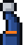 |
| `SCRIBE39.armL` | 4×8 | SCRIBE39, armL. Source: `ui/art/orbital/scribe39.png` |  |
| `SCRIBE39.scroll` | 5×7 | SCRIBE39, scroll. Source: `ui/art/orbital/scribe39.png` |  |
| `ADEPT39.E` | 12×14 | ADEPT39, 39° view, walking E, 3 frames. Source: `ui/art/orbital/adept39.png` | 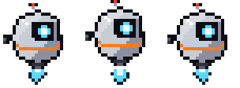 |
| `ADEPT39.W` | 12×14 | ADEPT39, 39° view, walking W, 3 frames. Source: `ui/art/orbital/adept39.png` | 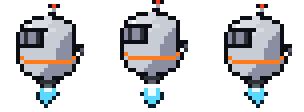 |
| `ADEPT39.S` | 12×14 | ADEPT39, 39° view, walking S, 3 frames. Source: `ui/art/orbital/adept39.png` | 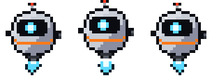 |
| `ADEPT39.N` | 12×14 | ADEPT39, 39° view, walking N, 3 frames. Source: `ui/art/orbital/adept39.png` | 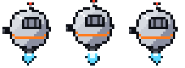 |
| `MAGOS39.body` | 24×24 | MAGOS39, body. Source: `ui/art/orbital/magos39.png` | 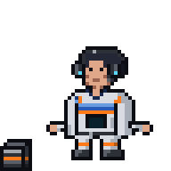 |
| `MAGOS39.arm` | 5×24 | MAGOS39, arm. Source: `ui/art/orbital/magos39.png` |  |
| `SKULL39.skull` | 10×10 | SKULL39, skull. Source: `ui/art/orbital/skull39.png` | 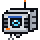 |

## Props and furniture

| Sprite | Logical size | Notes | Image |
|---|---|---|---|
| `ARM` | 4×8 | Scribe's right arm at the desk (raised with the scroll when a long turn finishes). Source: `ui/art/orbital/scribe.png`, drawn by actors.js | 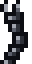 |
| `ARM_L` | 4×8 | Scribe's left arm at the desk. Source: `ui/art/orbital/scribe.png`, drawn by actors.js |  |
| `DESK` | 32×21 | Scribe's desk: screen and candle lit while busy. Source: `ui/art/orbital/workstations.png`, drawn by scene.js | 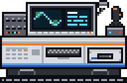 |
| `DESK.unlit` | 32×21 | DESK, unlit. Source: `ui/art/orbital/workstations.png` | 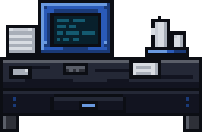 |
| `LECTERN` | 22×21 | Compact desk once the hall is full (6 a row). Source: `ui/art/orbital/workstations.png`, drawn by scene.js | 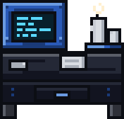 |
| `LECTERN.unlit` | 22×21 | LECTERN, unlit. Source: `ui/art/orbital/workstations.png` | 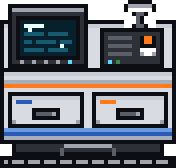 |
| `CONSOLE` | 14×10 | Adept console, one per subagent. Source: `ui/art/orbital/workstations.png`, drawn by scene.js |  |
| `CONSOLE.unlit` | 14×10 | CONSOLE, unlit. Source: `ui/art/orbital/workstations.png` |  |
| `COGITATOR` | 82×50 | Cogitator bank on the back wall: where shell commands run. Source: `ui/art/orbital/cogitator.png`, drawn by scene.js, scene39.js | 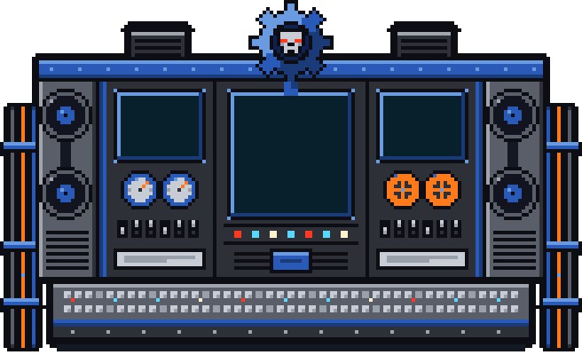 |
| `THRONE` | 20×20 | The Magos's throne (Sanctum). Source: `ui/art/orbital/sanctum.png`, drawn by scene.js | 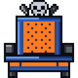 |
| `LORD_DESK` | 44×13 | The Magos's desk, petitions queue before it. Source: `ui/art/orbital/sanctum.png`, drawn by scene.js | 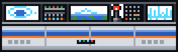 |
| `COG_MECH` | 20×18 | Cog Mechanicus above the throne. Source: `ui/art/orbital/sanctum.png`, drawn by scene.js | 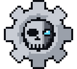 |
| `SEAL` | 6×10 | Purity seals on the lord desk. Source: `ui/art/orbital/sanctum.png`, drawn by scene.js |  |
| `GATE` | 32×30 | Grand gate frame: sessions enter and leave here. Source: `ui/art/orbital/gate.png`, drawn by isohall.js, scene.js | 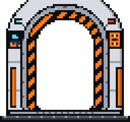 |
| `GATE_L` | 8×22 | Grand gate, left leaf (slides open). Source: `ui/art/orbital/gate.png`, drawn by scene.js, scene39.js | 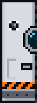 |
| `GATE_R` | 8×22 | Grand gate, right leaf (slides open). Source: `ui/art/orbital/gate.png`, drawn by scene.js, scene39.js | 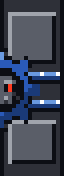 |
| `GATE_VOID` | 16×22 | ?. Source: `ui/art/orbital/gate.png`, drawn by scene.js, scene39.js |  |
| `RECAFF` | 16×18 | Recaff dispenser (Refectorium), first stop of an idle scribe. Source: `ui/art/orbital/refectorium.png`, drawn by scene.js |  |
| `TABLE` | 46×8 | Refectorium table. Source: `ui/art/orbital/refectorium.png`, drawn by scene.js | 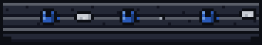 |
| `BENCH` | 46×4 | Refectorium bench: long-idle scribes sleep here. Source: `ui/art/orbital/refectorium.png`, drawn by scene.js |  |
| `WINDOW` | 16×17 | Window: day or night glass, casts a beam by day. Source: `ui/art/orbital/walls.png`, drawn by scene.js, theme.js, wallart.js |  |
| `WINDOW.day` | 16×17 | WINDOW, day. Source: `ui/art/orbital/walls.png` |  |
| `WINDOW.night` | 16×17 | WINDOW, night. Source: `ui/art/orbital/walls.png` |  |
| `BANNER` | 12×15 | Wall banner (the Sanctum wall; the back walls of a world without its own hangings). Source: `ui/art/orbital/walls.png`, drawn by isohall.js, scene.js, wallart.js |  |
| `SHELF` | 32×21 | Bookshelf on the back wall. Source: `ui/art/orbital/walls.png`, drawn by isohall.js, scene.js |  |
| `GAUGE` | 6×6 | Pressure gauge on the Sanctum pillars. Source: `ui/art/orbital/walls.png`, drawn by scene.js |  |
| `CENSER` | 5×10 | Censer. Source: `ui/art/orbital/walls.png`, drawn by scene.js |  |
| `WINDOW_TALL` | 18×42 | Tall gothic window on the back walls: day or night glass, casts a beam by day. Source: `ui/art/orbital/walls.png`, drawn by wallart.js |  |
| `WINDOW_TALL.day` | 18×42 | WINDOW_TALL, day. Source: `ui/art/orbital/walls.png` |  |
| `WINDOW_TALL.night` | 18×42 | WINDOW_TALL, night. Source: `ui/art/orbital/walls.png` |  |
| `HANGING` | 13×50 | Full-height hanging on the back walls. Source: `ui/art/orbital/walls.png`, drawn by isohall.js, scene.js, wallart.js |  |
| `PAPER_STACK` | 8×12 | Paper tower (decor). Source: `ui/art/orbital/clutter.png`, drawn by scene.js |  |
| `SCROLL_PILE` | 18×7 | Scroll pile (decor). Source: `ui/art/orbital/clutter.png`, drawn by scene.js |  |
| `BOOKS` | 10×9 | Book pile (decor). Source: `ui/art/orbital/clutter.png`, drawn by scene.js |  |
| `LOOSE_A` | 5×4 | Loose sheet on the floor (decor). Source: `ui/art/orbital/clutter.png`, drawn by scene.js |  |
| `LOOSE_B` | 4×5 | Loose sheet on the floor (decor). Source: `ui/art/orbital/clutter.png`, drawn by scene.js |  |
| `CRATE` | 14×12 | Supply crate. Source: `ui/art/orbital/clutter.png`, drawn by scene.js |  |
| `SKULL` | 10×10 | Servo-skull: perched by the Magos, courier on git push, red-eyed over a stale petition. Source: `ui/art/orbital/skull.png`, drawn by scene.js, scene39.js |  |
| `SKULL.alarm` | 10×10 | SKULL, alarm. Source: `ui/art/orbital/skull.png` |  |
| `SCROLL` | 6×7 | Sealed petition scroll, held while queued in the Sanctum. Source: `ui/art/orbital/petitions.png`, drawn by actors.js |  |
| `QSCROLL` | 6×7 | Question scroll: the turn ended with a question. Source: `ui/art/orbital/petitions.png`, drawn by actors.js, scene39.js |  |
| `SCROLL_HELD` | 14×7 | The finished scroll a scribe raises when a long turn is done. Source: `ui/art/orbital/petitions.png`, drawn by actors.js, scene39.js |  |
| `BRAZIER` | 10×13 | Brazier at the gate and in the Sanctum; compaction burns here. Source: `ui/art/orbital/fire.png`, drawn by scene.js, scene39.js |  |
| `CANDLES` | 12×9 | Candle cluster. Source: `ui/art/orbital/fire.png`, drawn by scene.js |  |
| `COMMIT_SEAL` | 4×7.5 | Purity seal hung on the desk for each commit (up to 3). Source: `ui/art/orbital/commits.png`, drawn by scene.js |  |
| `COMMIT_TAG` | 4×7.5 | The seal's strips before the wax lands. Source: `ui/art/orbital/commits.png`, drawn by scene.js |  |
| `COMMIT_STAMP` | 4×6 | The stamp that seals a commit. Source: `ui/art/orbital/commits.png`, drawn by scene.js |  |

## Room tiles

| Sprite | Logical size | Notes | Image |
|---|---|---|---|
| `ROOM.floor` | 12×12 | `floor`: repeats both ways (shown repeated). Source: `ui/art/orbital/room-floor.png` |  |
| `ROOM.channel_h` | 24×2 | `channel h`: repeats along x, glows (coolant) (shown repeated). Source: `ui/art/orbital/room-floor.png` |  |
| `ROOM.channel_v` | 2×24 | `channel v`: repeats along y, glows (coolant) (shown repeated). Source: `ui/art/orbital/room-floor.png` |  |
| `ROOM.sanctum_passage` | 6×6 | `sanctum passage`: repeats both ways (shown repeated). Source: `ui/art/orbital/room-floor.png` |  |
| `ROOM.sill` | 72×2 | `sill`: repeats along x (shown repeated). Source: `ui/art/orbital/room-floor.png` |  |
| `ROOM.sanctum_floor` | 20×20 | `sanctum floor`: nine-slice (corners kept, edges and centre repeat). Source: `ui/art/orbital/room-floor.png` |  |
| `ROOM.wall_top` | 12×10 | `wall top`: drawn as is. Source: `ui/art/orbital/room-walls.png` |  |
| `ROOM.wall` | 36×30 | `wall`: repeats both ways, first row from `wall top` (shown repeated). Source: `ui/art/orbital/room-walls.png` |  |
| `ROOM.wall_east_top` | 12×10 | `wall east top`: drawn as is. Source: `ui/art/orbital/room-walls.png` |  |
| `ROOM.wall_east` | 36×30 | `wall east`: repeats both ways, first row from `wall east top` (shown repeated). Source: `ui/art/orbital/room-walls.png` |  |
| `ROOM.wall_sanctum_top` | 12×10 | `wall sanctum top`: drawn as is. Source: `ui/art/orbital/room-walls.png` |  |
| `ROOM.wall_sanctum` | 36×30 | `wall sanctum`: repeats both ways, first row from `wall sanctum top` (shown repeated). Source: `ui/art/orbital/room-walls.png` |  |
| `ROOM.wall_foot` | 6×6 | `wall foot`: repeats both ways (shown repeated). Source: `ui/art/orbital/room-walls.png` |  |
| `ROOM.wall_dark` | 6×6 | `wall dark`: repeats both ways (shown repeated). Source: `ui/art/orbital/room-walls.png` |  |
| `ROOM.wall_base` | 12×3 | `wall base`: repeats along x (shown repeated). Source: `ui/art/orbital/room-walls.png` |  |
| `ROOM.sanctum_base` | 12×3 | `sanctum base`: repeats along x (shown repeated). Source: `ui/art/orbital/room-walls.png` |  |
| `ROOM.pillar` | 10×24 | `pillar`: repeats along y (shown repeated). Source: `ui/art/orbital/room-walls.png` |  |
| `ROOM.pilaster` | 4×19.5 | `pilaster`: drawn as is. Source: `ui/art/orbital/room-walls.png` |  |
| `ROOM.beacon_off` | 7×10 | `beacon off`: drawn as is. Source: `ui/art/orbital/room-walls.png` |  |
| `ROOM.beacon_on` | 7×10 | `beacon on`: drawn as is. Source: `ui/art/orbital/room-walls.png` |  |
| `ROOM.beacon_cage` | 7×10 | `beacon cage`: drawn as is. Source: `ui/art/orbital/room-walls.png` |  |
| `ROOM.pipe_h` | 24×3 | `pipe h`: repeats along x (shown repeated). Source: `ui/art/orbital/room-pipes.png` |  |
| `ROOM.pipe_v` | 3×24 | `pipe v`: repeats along y (shown repeated). Source: `ui/art/orbital/room-pipes.png` |  |
| `ROOM.fitting_h` | 3×5 | `fitting h`: drawn as is. Source: `ui/art/orbital/room-pipes.png` |  |
| `ROOM.fitting_v` | 5×3 | `fitting v`: drawn as is. Source: `ui/art/orbital/room-pipes.png` |  |
| `ROOM.fitting_wide` | 10×2 | `fitting wide`: drawn as is. Source: `ui/art/orbital/room-pipes.png` |  |
| `ROOM.door_sanctum_closed` | 10×40 | `door sanctum closed`: drawn as is. Source: `ui/art/orbital/room-doors.png` |  |
| `ROOM.door_sanctum_open` | 10×40 | `door sanctum open`: drawn as is. Source: `ui/art/orbital/room-doors.png` |  |
| `ROOM.door_refectory_closed` | 10×24 | `door refectory closed`: drawn as is. Source: `ui/art/orbital/room-doors.png` |  |
| `ROOM.door_refectory_open` | 10×24 | `door refectory open`: drawn as is. Source: `ui/art/orbital/room-doors.png` |  |

## Face sheets (39° side and top faces)

| Sprite | Logical size | Notes | Image |
|---|---|---|---|
| `FACES.DESK` | 5×12 | DESK, 39° view only: side, top, keys wall, keys floor, rack side, rack top, monitor side, monitor top, monitor screen wall, monitor screen floor, monitor screen 2 wall, monitor screen 2 floor, lamp top, arm top, stick base side, stick base top, stick top. Source: `ui/art/orbital/faces.png` |  |
| `FACES.LECTERN` | 5×12.5 | LECTERN, 39° view only: side, top, board side, board top, monitor side, monitor top, monitor screen wall, monitor screen floor, box side, box top, box slot wall, box slot floor, lamp top, stem top. Source: `ui/art/orbital/faces.png` |  |
| `FACES.CONSOLE` | 2.5×0.5 | CONSOLE, 39° view only: side, top, stalk top, deck side, deck top, monitor side, monitor top, monitor screen wall, monitor screen floor. Source: `ui/art/orbital/faces.png` |  |
| `FACES.SHELF` | 2.5×21 | SHELF, 39° view only: side, top, bay wall, bay floor, bay 2 wall, bay 2 floor. Source: `ui/art/orbital/faces.png` |  |
| `FACES.COGITATOR` | 4×43.5 | COGITATOR, 39° view only: side, top, map wall, map floor, wave wall, wave floor, planet wall, planet floor, screen wall, screen floor, bars wall, bars floor, scope wall, scope floor, shoulder L side, shoulder L top, shoulder R side, shoulder R top, cap L side, cap L top, cap R side, cap R top, vents L side, vents L top, vents R side, vents R top, rack L side, rack L top, rack L screen wall, rack L screen floor, rack R side, rack R top, rack R screen wall, rack R screen floor, fan 1 rim, fan 2 rim, fan 3 rim, fan 4 rim, ledge side, ledge top. Source: `ui/art/orbital/faces.png` |  |
| `FACES.CRATE` | 4.5×10.5 | CRATE, 39° view only: side, top, handle side, handle top. Source: `ui/art/orbital/faces.png` |  |
| `FACES.TABLE` | 5.5×1.5 | TABLE, 39° view only: slab side, slab top, leg 1 front, leg 1 top, leg 2 front, leg 2 top, foot 1 side, foot 1 top, foot 2 side, foot 2 top. Source: `ui/art/orbital/faces.png` |  |
| `FACES.BENCH` | 2×1 | BENCH, 39° view only: side, top, leg 1 front, leg 1 side, leg 1 top, leg 2 front, leg 2 side, leg 2 top, leg 3 front, leg 3 side, leg 3 top, cushion side, cushion top. Source: `ui/art/orbital/faces.png` |  |
| `FACES.RECAFF` | 3.5×1.5 | RECAFF, 39° view only: side, top, foot 1 side, foot 1 top, foot 2 side, foot 2 top, dispenser side, dispenser top, dispenser screen wall, dispenser screen floor, dispenser alcove wall, dispenser alcove floor, cup top, neck side, neck top, warmer side, warmer top, warmer window wall, warmer window floor, can 1 top, can 2 top, can 3 top, can 4 top. Source: `ui/art/orbital/faces.png` |  |
| `FACES.LORD_DESK` | 5.5×7.5 | LORD_DESK, 39° view only: side, top, radar glass side, radar glass top, radar wall side, radar wall top, radar back side, radar back top, keys glass side, keys glass top, keys wall side, keys wall top, keys back side, keys back top, map glass side, map glass top, map wall side, map wall top, map back side, map back top, scope glass side, scope glass top, scope wall side, scope wall top, scope back side, scope back top, lever base side, lever base top, lever top, knob top. Source: `ui/art/orbital/faces.png` |  |
| `FACES.THRONE` | 4.5×2 | THRONE, 39° view only: side, top, post top, seat side, seat top, back side, back top, arm L side, arm L top, arm R side, arm R top, headrest side, headrest top. Source: `ui/art/orbital/faces.png` |  |
| `FACES.COG_MECH` | 18×17 | COG_MECH, 39° view only: patch rim. Source: `ui/art/orbital/faces.png` |  |
| `FACES.SEAL` | 6×7.5 | SEAL, 39° view only: tag rim. Source: `ui/art/orbital/faces.png` |  |
| `FACES.GAUGE` | 6×6 | GAUGE, 39° view only: dial rim. Source: `ui/art/orbital/faces.png` |  |
| `FACES.CENSER` | 1×1.5 | CENSER, 39° view only: canopy side, canopy top, cord top, neck top, shade top. Source: `ui/art/orbital/faces.png` |  |
| `FACES.CANDLES` | 2×2 | CANDLES, 39° view only: base side, base top, rod top, bracket L side, bracket L top, bracket R side, bracket R top, bar side, bar top, knob top. Source: `ui/art/orbital/faces.png` |  |
| `FACES.BRAZIER` | 2×0.5 | BRAZIER, 39° view only: foot 1 side, foot 1 top, foot 2 side, foot 2 top, base side, base top, unit side, unit top, unit fan wall, unit fan floor, pipe top. Source: `ui/art/orbital/faces.png` |  |
| `FACES.GATE` | 6.5×1.5 | GATE, 39° view only: base side, base top, sill side, sill top, head rim, jamb L rim, jamb R rim, panel L side, panel L top, panel R side, panel R top, lamps L side, lamps L top, lamps R side, lamps R top, leaves side, leaves top. Source: `ui/art/orbital/faces.png` |  |
| `FACES.BOOKS` | 2.5×7.5 | BOOKS, 39° view only: binder 1 side, binder 1 top, binder 2 side, binder 2 top, binder 3 side, binder 3 top, binder 4 side, binder 4 top, strap side, strap top. Source: `ui/art/orbital/faces.png` |  |
| `FACES.PAPER_STACK` | 1×12 | PAPER_STACK, 39° view only: board side, board top, card 1 side, card 1 top, card 2 side, card 2 top, card 3 side, card 3 top. Source: `ui/art/orbital/faces.png` |  |
| `FACES.SCROLL_PILE` | 2.5×4.5 | SCROLL_PILE, 39° view only: bag L side, bag L top, bag M side, bag M top, bag R2 side, bag R2 top, bag R side, bag R top, bag top side, bag top top, handle side, handle top, handle 2 side, handle 2 top. Source: `ui/art/orbital/faces.png` |  |
